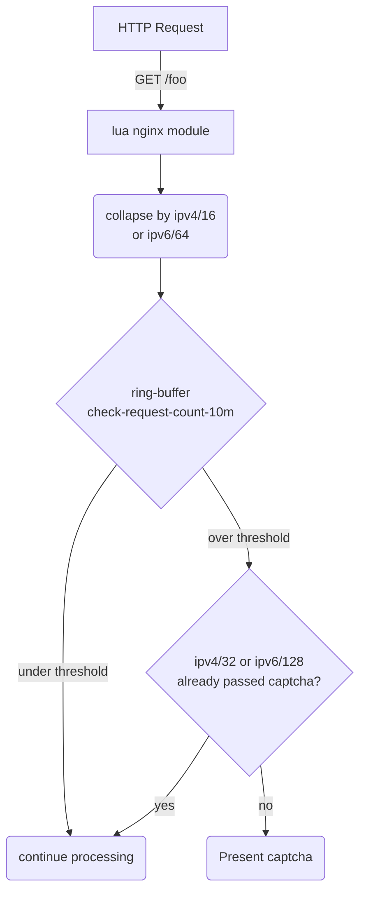

# 🧃

CIDR rate limiter

General rate limiter to catch/limit distributed crawlers

```mermaid
flowchart TD
    A[HTTP Request] -->|GET /foo| B[lua nginx module]
    B --> C(collapse by ipv4/16<br>or ipv6/64)
    C --> D{ring-buffer<br>check-request-count-10m}
    D -->|over threshold| E{ipv4/32 or ipv6/128<br>already passed captcha?}
    D -->|under threshold| F(continue processing)
    E -- yes --> F
    E -- no --> G(Present captcha)
```
